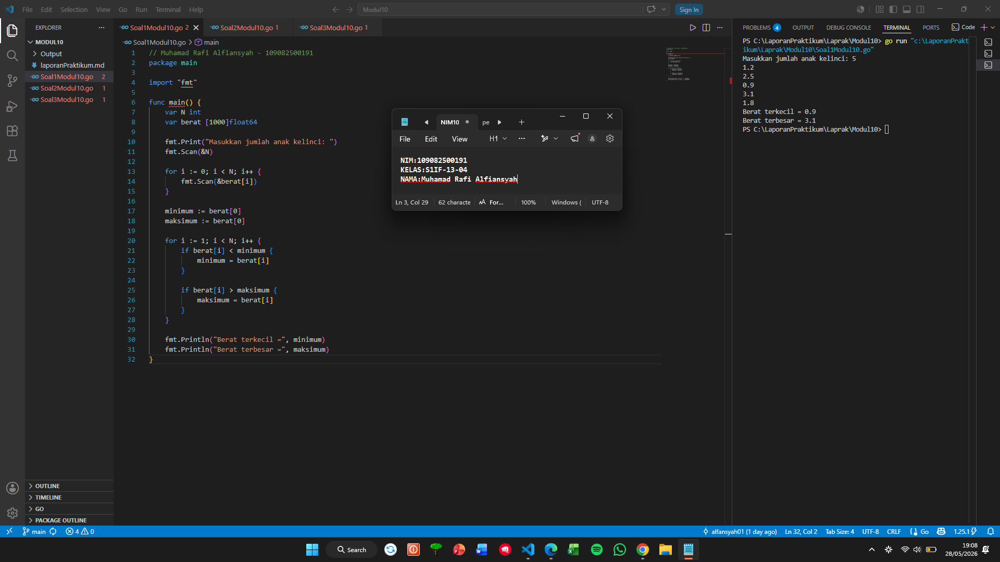
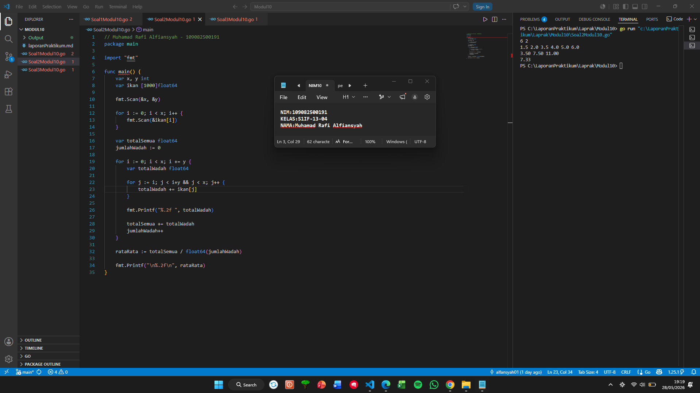
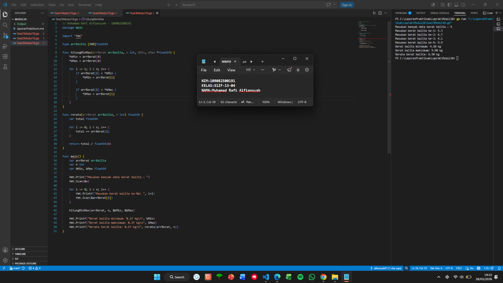

# <h1 align="center">Laporan Praktikum Modul 10 - PENCARIAN NILAI MAX/MIN </h1>
<p align="center">Muhamad Rafi Alfiansyah - 109082500191</p>

## Unguided 

### 1. [Soal]
#### Soal1Modul10.go

```go
// Muhamad Rafi Alfiansyah - 109082500191
package main

import "fmt"

func main() {
	var N int
	var berat [1000]float64

	fmt.Print("Masukkan jumlah anak kelinci: ")
	fmt.Scan(&N)

	for i := 0; i < N; i++ {
		fmt.Scan(&berat[i])
	}

	minimum := berat[0]
	maksimum := berat[0]

	for i := 1; i < N; i++ {
		if berat[i] < minimum {
			minimum = berat[i]
		}

		if berat[i] > maksimum {
			maksimum = berat[i]
		}
	}

	fmt.Println("Berat terkecil =", minimum)
	fmt.Println("Berat terbesar =", maksimum)
}
```
### Output Unguided :

##### Output 

[penjelasan]
program buat cari berat anak kelinci terkecil dan terbesar pake array bertipe float64 dengan kapasitas 1000. Program minta input jumlah anak kelinci yang mau ditimbang, kemudian data beratnya disimpan ke dalam array. Program melakukan proses pencarian nilai min dan maks dengan jadiin data pertama jadi nilai awal pembanding. Data dibandingkan satu per satu sampai semua data selesai diperiksa. Outputnya berupa berat kelinci terbesar dan terkecil.

### 2. [Soal]
#### Soal2Modul10.go

```go
// Muhamad Rafi Alfiansyah - 109082500191
package main

import "fmt"

func main() {
	var x, y int
	var ikan [1000]float64

	fmt.Scan(&x, &y)

	for i := 0; i < x; i++ {
		fmt.Scan(&ikan[i])
	}

	var totalSemua float64
	jumlahWadah := 0

	for i := 0; i < x; i += y {
		var totalWadah float64

		for j := i; j < i+y && j < x; j++ {
			totalWadah += ikan[j]
		}

		fmt.Printf("%.2f ", totalWadah)

		totalSemua += totalWadah
		jumlahWadah++
	}

	rataRata := totalSemua / float64(jumlahWadah)

	fmt.Printf("\n%.2f\n", rataRata)
}
```
### Output Unguided :

##### Output 

[penjelasan]
Program buat hitung total berat ikan ditiap wadah dan cari rata - rata berat seluruh wadahnya pake array bertipe float64 dengan kapasitas 1000. Input berupa kumlah ikan dan jumlah ikan yang dimasukkan ke tiap wadah, terus data berat ikannya disimpan ke array. Lalu menghitung total berat ikan ditiap wadah sesuai urutan data yang dimasukkan. Total berat setiap wadah ditampilkan, lalu seluruh total wadah dijumlahkan untuk mencari nilai rata-ratanya. Output program berupa total berat ikan pada setiap wadah dan rata-rata berat seluruh wadah.

### 3. [Soal]
#### Soal3Modul10.go

```go
// Muhamad Rafi Alfiansyah - 109082500191
package main

import "fmt"

type arrBalita [100]float64

func hitungMinMax(arrBerat arrBalita, n int, bMin, bMax *float64) {
	*bMin = arrBerat[0]
	*bMax = arrBerat[0]

	for i := 1; i < n; i++ {
		if arrBerat[i] < *bMin {
			*bMin = arrBerat[i]
		}

		if arrBerat[i] > *bMax {
			*bMax = arrBerat[i]
		}
	}
}

func rerata(arrBerat arrBalita, n int) float64 {
	var total float64

	for i := 0; i < n; i++ {
		total += arrBerat[i]
	}

	return total / float64(n)
}

func main() {
	var arrBerat arrBalita
	var n int
	var bMin, bMax float64

	fmt.Print("Masukan banyak data berat balita : ")
	fmt.Scan(&n)

	for i := 0; i < n; i++ {
		fmt.Printf("Masukan berat balita ke-%d: ", i+1)
		fmt.Scan(&arrBerat[i])
	}

	hitungMinMax(arrBerat, n, &bMin, &bMax)

	fmt.Printf("Berat balita minimum: %.2f kg\n", bMin)
	fmt.Printf("Berat balita maksimum: %.2f kg\n", bMax)
	fmt.Printf("Rerata berat balita: %.2f kg\n", rerata(arrBerat, n))
}
```
### Output Unguided :

##### Output 

[penjelasan]
Program buat cari berat balita terkecil, terbesar dan rata - rata pake array bertipe float64 dengan kapasitas 100. Input berupa jumlah balita. Proses pencarian nilai minimum dan maksimum dilakukan menggunakan fungsi hitungMinMax dengan menjadikan data pertama sebagai nilai awal pembanding, lalu seluruh data dibandingkan satu per satu sampai selesai. Program menggunakan fungsi rerata untuk menghitung rata-rata berat balita dengan menjumlahkan seluruh data kemudian membaginya dengan banyak data. Output program berupa berat balita minimum, maksimum, dan rata-rata berat balita.