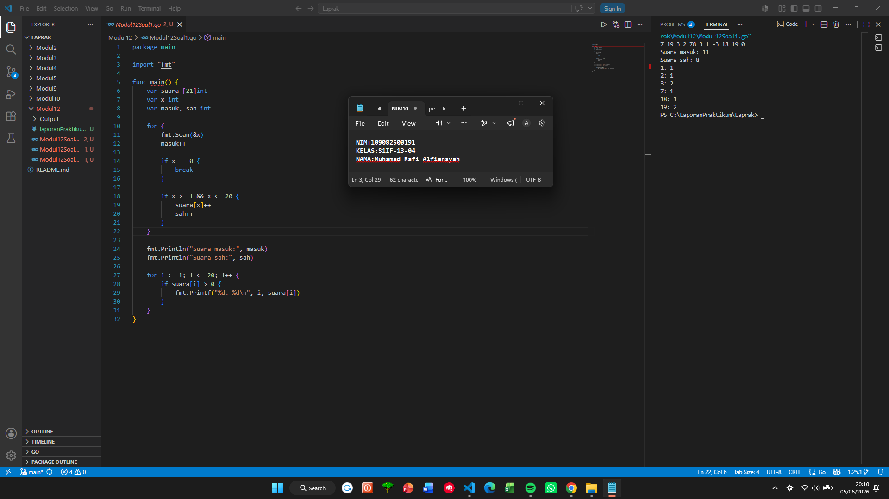
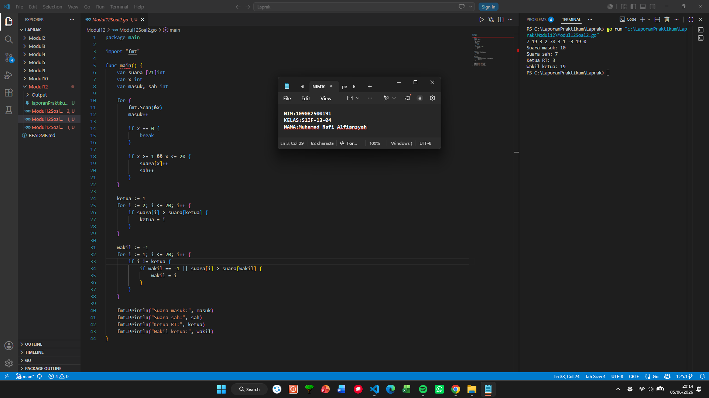
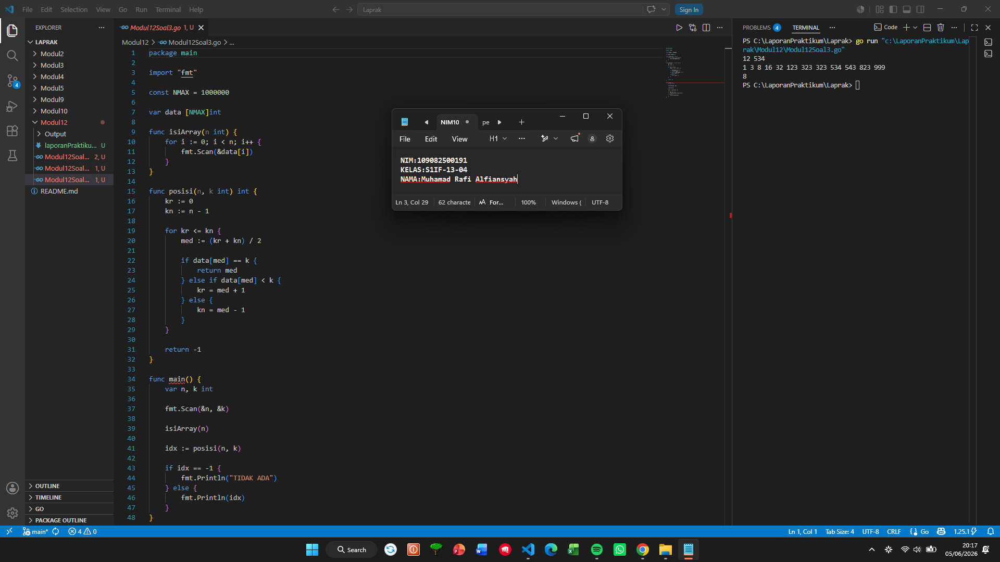

# <h1 align="center">Laporan Praktikum Modul 12 - SEARCHING </h1>
<p align="center">Muhamad Rafi Alfiansyah - 109082500191</p>

## unguided 

### 1. Soal1
#### Modul12Soal1.go

```go
package main

import "fmt"

func main() {
	var suara [21]int
	var x int
	var masuk, sah int

	for {
		fmt.Scan(&x)
		masuk++

		if x == 0 {
			break
		}

		if x >= 1 && x <= 20 {
			suara[x]++
			sah++
		}
	}

	fmt.Println("Suara masuk:", masuk)
	fmt.Println("Suara sah:", sah)

	for i := 1; i <= 20; i++ {
		if suara[i] > 0 {
			fmt.Printf("%d: %d\n", i, suara[i])
		}
	}
}
```

### Output unguided :

##### Output 

### Penjelasan :
Program ini digunakan untuk menghitung hasil suara pada pemilihan ketua RT. Data suara dimasukkan satu per satu dan akan terus dibaca hingga pengguna memasukkan angka 0 sebagai tanda bahwa proses input telah selesai. Setiap data yang masuk akan dihitung sebagai suara masuk, kemudian program akan memeriksa apakah suara tersebut valid atau tidak. Suara dianggap valid jika memiliki nilai antara 1 sampai 20 sesuai dengan nomor calon yang tersedia. Seluruh suara yang valid akan dihitung dan disimpan menggunakan array sehingga jumlah suara yang diperoleh setiap calon dapat diketahui. Setelah semua data selesai diproses, program akan menampilkan jumlah suara yang masuk, jumlah suara yang sah, serta daftar calon yang memperoleh suara beserta total suaranya.

### 2. Soal2
#### Modul12Soal1.go

```go
package main

import "fmt"

func main() {
	var suara [21]int
	var x int
	var masuk, sah int

	for {
		fmt.Scan(&x)
		masuk++

		if x == 0 {
			break
		}

		if x >= 1 && x <= 20 {
			suara[x]++
			sah++
		}
	}

	ketua := 1
	for i := 2; i <= 20; i++ {
		if suara[i] > suara[ketua] {
			ketua = i
		}
	}

	wakil := -1
	for i := 1; i <= 20; i++ {
		if i != ketua {
			if wakil == -1 || suara[i] > suara[wakil] {
				wakil = i
			}
		}
	}

	fmt.Println("Suara masuk:", masuk)
	fmt.Println("Suara sah:", sah)
	fmt.Println("Ketua RT:", ketua)
	fmt.Println("Wakil ketua:", wakil)
}
```

### Output Unguided :

##### Output 

### Penjelasan :
Program ini merupakan pengembangan dari program sebelumnya yang tidak hanya menghitung jumlah suara, tetapi juga menentukan pemenang pemilihan ketua RT dan wakil ketua RT. Setelah semua suara dibaca dan divalidasi, program menghitung jumlah suara yang diperoleh masing-masing calon. Selanjutnya dilakukan pencarian calon dengan jumlah suara terbanyak untuk ditetapkan sebagai ketua RT. Setelah ketua ditemukan, program mencari calon lain dengan jumlah suara terbanyak berikutnya untuk dijadikan wakil ketua RT. Dengan cara ini, proses penentuan ketua dan wakil dapat dilakukan secara otomatis berdasarkan hasil perolehan suara yang telah dihitung sebelumnya. Hasil akhir yang ditampilkan berupa jumlah suara masuk, jumlah suara sah, serta nomor calon yang terpilih sebagai ketua dan wakil ketua RT.

### 3. Soal3
#### Modul12Soal1.go

```go
package main

import "fmt"

const NMAX = 1000000

var data [NMAX]int

func isiArray(n int) {
	for i := 0; i < n; i++ {
		fmt.Scan(&data[i])
	}
}

func posisi(n, k int) int {
	kr := 0
	kn := n - 1

	for kr <= kn {
		med := (kr + kn) / 2

		if data[med] == k {
			return med
		} else if data[med] < k {
			kr = med + 1
		} else {
			kn = med - 1
		}
	}

	return -1
}

func main() {
	var n, k int

	fmt.Scan(&n, &k)

	isiArray(n)

	idx := posisi(n, k)

	if idx == -1 {
		fmt.Println("TIDAK ADA")
	} else {
		fmt.Println(idx)
	}
}
```

### Output Unguided :

##### Output 

### Penjelasan :
Program ini dibuat untuk mencari posisi suatu bilangan pada kumpulan data yang sudah terurut secara menaik. Untuk mempercepat proses pencarian, program menggunakan algoritma Binary Search yang merupakan salah satu metode pencarian yang efisien pada data terurut. Mula-mula program membaca jumlah data dan nilai yang ingin dicari, kemudian seluruh data disimpan ke dalam array melalui prosedur isiArray. Setelah itu fungsi posisi akan melakukan pencarian dengan membandingkan nilai yang dicari terhadap elemen tengah array. Jika nilai yang dicari lebih besar, pencarian dilanjutkan ke bagian kanan array, sedangkan jika lebih kecil pencarian dilanjutkan ke bagian kiri array. Proses ini terus dilakukan hingga data ditemukan atau sudah tidak ada lagi bagian array yang dapat diperiksa. Jika data ditemukan, program akan menampilkan indeks posisi data tersebut. Namun apabila data tidak ditemukan, program akan menampilkan tulisan "TIDAK ADA" sebagai tanda bahwa nilai yang dicari tidak terdapat pada kumpulan data yang diberikan.