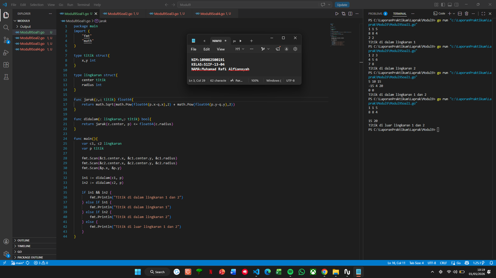
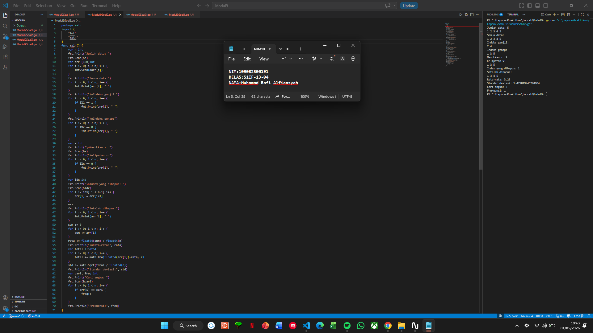
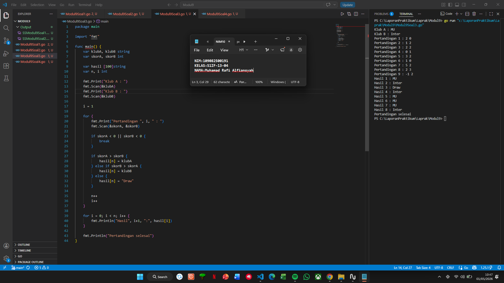
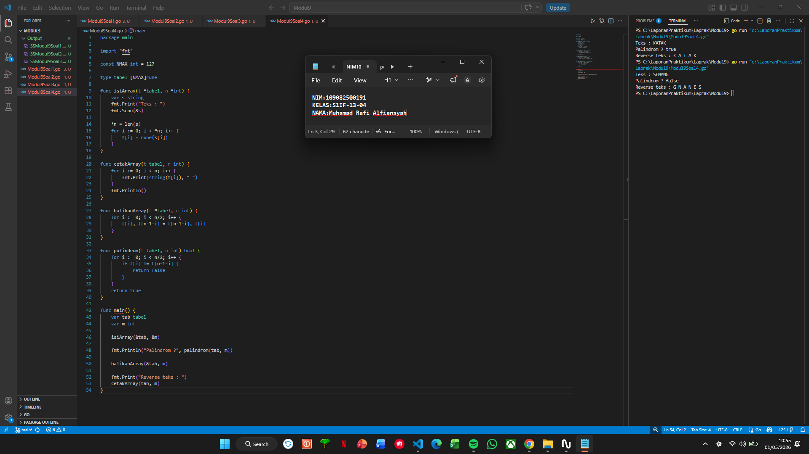

# <h1 align="center">Laporan Praktikum Modul 9 - ARRAY</h1>
<p align="center">Muhamad Rafi Alfiansyah - 109082500191</p>

## Unguided 

### 1. [Soal]
#### soal1.go

```go
package main
import (
	"fmt"
	"math"
)

type titik struct{
	x,y int
}

type lingkaran struct{
	center titik
	radius int
}

func jarak(p,q titik) float64{
	return math.Sqrt(math.Pow(float64(p.x-q.x),2) + math.Pow(float64(p.y-q.y),2))
}

func didalam(c lingkaran,p titik) bool{
	return jarak(c.center, p) <= float64(c.radius)
}

func main(){
	var c1, c2 lingkaran
	var p titik

	fmt.Scan(&c1.center.x, &c1.center.y, &c1.radius)
	fmt.Scan(&c2.center.x, &c2.center.y, &c2.radius)
	fmt.Scan(&p.x, &p.y)

	in1 := didalam(c1, p)
	in2 := didalam(c2, p)

	if in1 && in2 {
		fmt.Println("Titik di dalam lingkaran 1 dan 2")
	} else if in1 {
		fmt.Println("Titik di dalam lingkaran 1")
	} else if in2 {
		fmt.Println("Titik di dalam lingkaran 2")
	} else {
		fmt.Println("Titik di luar lingkaran 1 dan 2")
	}
}
```
### Output Unguided :

##### Output 

[penjelasan]
Program buat menentukan posisi titik terhadap dua lingkaran. Pertama dibuat tipe bentukan titik untuk menyimpan koordinat (x,y) dan tipe lingkaran yang berisi titik pusat dan jari jari.
Kemudian dibuat fungsi jarak untuk menghitung jarak antara dua titik menggunakan rumus jarak Euclidean. Fungsi ini dipakai di dalam fungsi didalam untuk mengecek apakah suatu titik berada di dalam lingkaran, yaitu dengan membandingkan jarak titik ke pusat lingkaran dengan nilai radius.
Di dalam fungsi main program menerima input data dua lingkaran (titik pusat dan radius) serta satu titik sembarang. Setelah itu dilakukan pengecekan apakah titik tersebut berada di dalam lingkaran pertama, lingkaran kedua, keduanya, atau tidak di dalam keduanya.
Hasil akhir ditampilkan dalam bentuk kalimat sesuai dengan posisi titik terhadap kedua lingkaran tersebut.

### 2. [Soal]
#### soal1.go

```go
package main
import (
	"fmt"
	"math"
)
func main() {
	var n int
	fmt.Print("Jumlah data: ")
	fmt.Scan(&n)
	var arr [100]int
	for i := 0; i < n; i++ {
		fmt.Scan(&arr[i])
	}
	fmt.Println("Semua data:")
	for i := 0; i < n; i++ {
		fmt.Print(arr[i], " ")
	}
	fmt.Println("\nIndeks ganjil:")
	for i := 0; i < n; i++ {
		if i%2 == 1 {
			fmt.Print(arr[i], " ")
		}
	}
	fmt.Println("\nIndeks genap:")
	for i := 0; i < n; i++ {
		if i%2 == 0 {
			fmt.Print(arr[i], " ")
		}
	}
	var x int
	fmt.Print("\nMasukkan x: ")
	fmt.Scan(&x)
	fmt.Println("Kelipatan x:")
	for i := 0; i < n; i++ {
		if i%x == 0 {
			fmt.Print(arr[i], " ")
		}
	}
	var idx int
	fmt.Print("\nIndex yang dihapus: ")
	fmt.Scan(&idx)
	for i := idx; i < n-1; i++ {
		arr[i] = arr[i+1]
	}
	n--
	fmt.Println("Setelah dihapus:")
	for i := 0; i < n; i++ {
		fmt.Print(arr[i], " ")
	}
	sum := 0
	for i := 0; i < n; i++ {
		sum += arr[i]
	}
	rata := float64(sum) / float64(n)
	fmt.Println("\nRata-rata:", rata)
	var total float64
	for i := 0; i < n; i++ {
		total += math.Pow(float64(arr[i])-rata, 2)
	}
	std := math.Sqrt(total / float64(n))
	fmt.Println("Standar deviasi:", std)
	var cari, freq int
	fmt.Print("Cari angka: ")
	fmt.Scan(&cari)
	for i := 0; i < n; i++ {
		if arr[i] == cari {
			freq++
		}
	}
	fmt.Println("Frekuensi:", freq)
}
```
### Output Unguided :

##### Output 

[penjelasan]
Program untuk menentukan posisi suatu titik terhadap dua lingkaran. dibuat tipe bentukan titik untuk menyimpan koordinat (x, y) dan tipe lingkaran yang berisi titik pusat serta jari-jari.
Kemudian dibuat fungsi jarak untuk menghitung jarak antara dua titik menggunakan rumus jarak Euclidean, hasil dari fungsi ini digunakan di fungsi didalam untuk mengecek apakah titik berada di dalam lingkaran, yaitu dengan membandingkan jarak titik ke pusat lingkaran dengan nilai radius.
Di dalam fungsi main, program menerima input dua lingkaran berupa titik pusat dan radius, serta satu titik sembarang. Setelah itu dilakukan pengecekan apakah titik tersebut berada di dalam lingkaran pertama, lingkaran kedua, keduanya, atau tidak berada di dalam keduanya.
Hasil akhirnya ditampilkan dalam bentuk kalimat yang menunjukkan posisi titik terhadap kedua lingkaran tersebut.

### 3. [Soal]
#### soal1.go

```go
package main

import "fmt"

func main() {
	var klubA, klubB string
	var skorA, skorB int

	var hasil [100]string
	var n, i int

	fmt.Print("Klub A : ")
	fmt.Scan(&klubA)
	fmt.Print("Klub B : ")
	fmt.Scan(&klubB)

	i = 1

	for {
		fmt.Print("Pertandingan ", i, " : ")
		fmt.Scan(&skorA, &skorB)

		if skorA < 0 || skorB < 0 {
			break
		}

		if skorA > skorB {
			hasil[n] = klubA
		} else if skorB > skorA {
			hasil[n] = klubB
		} else {
			hasil[n] = "Draw"
		}

		n++
		i++
	}

	for i = 0; i < n; i++ {
		fmt.Println("Hasil", i+1, ":", hasil[i])
	}

	fmt.Println("Pertandingan selesai")
}
```
### Output Unguided :

##### Output 

[penjelasan]
Program untuk mencatat hasil pertandingan antara dua klub bola. user memasukkan nama dua klub yang akan bertanding. abis tu program akan meminta input skor dari tiap pertandingan secara berulang, dengan format skor klub A dan klub B. Proses ini akan terus berjalan sampai salah satu atau kedua skor yang dimasukkan bernilai negatif, yang menandakan bahwa input pertandingan sudah selesai.
tiap hasil pertandingan akan dicek untuk menentukan pemenangnya. Kalo skor klub A lebih besar maka nama klub A disimpan, kalo skor klub B lebih besar maka nama klub B yang disimpan, dan kalo kedua skor sama maka disimpan sebagai “Draw”. Semua hasil tersebut disimpan dalam sebuah array untuk ditampilkan di akhir.
Setelah proses input selesai, program akan menampilkan daftar hasil pertandingan satu per satu sesuai urutan. Terakhir, program menampilkan pesan bahwa pertandingan telah selesai.

### 4. [Soal]
#### soal1.go

```go
package main

import "fmt"

const NMAX int = 127

type tabel [NMAX]rune

func isiArray(t *tabel, n *int) {
	var s string
	fmt.Print("Teks : ")
	fmt.Scan(&s)

	*n = len(s)
	for i := 0; i < *n; i++ {
		t[i] = rune(s[i])
	}
}

func cetakArray(t tabel, n int) {
	for i := 0; i < n; i++ {
		fmt.Print(string(t[i]), " ")
	}
	fmt.Println()
}

func balikanArray(t *tabel, n int) {
	for i := 0; i < n/2; i++ {
		t[i], t[n-1-i] = t[n-1-i], t[i]
	}
}

func palindrom(t tabel, n int) bool {
	for i := 0; i < n/2; i++ {
		if t[i] != t[n-1-i] {
			return false
		}
	}
	return true
}

func main() {
	var tab tabel
	var m int

	isiArray(&tab, &m)

	fmt.Println("Palindrom ?", palindrom(tab, m))

	balikanArray(&tab, m)

	fmt.Print("Reverse teks : ")
	cetakArray(tab, m)
}
```
### Output Unguided :

##### Output 

[penjelasan]
Program yg dibuat untuk mengolah sekumpulan karakter yang disimpan dalam array. Pertama, user memasukkan sebuah teks yang kemudian setiap karakternya disimpan ke dalam array bertipe rune. Jumlah karakter yang dimasukkan disimpan dalam variabel n agar bisa digunakan pada proses berikutnya.
Lalu program mengecek apakah susunan karakter tersebut merupakan palindrom atau tidak. Pengecekan dilakukan dengan membandingkan karakter dari depan dan belakang secara berpasangan. Kalo semua sama maka hasilnya true, kalo ada yang berbeda maka false.
Selanjutnya isi array dibalik menggunakan proses pertukaran elemen dari depan ke belakang. Habis dibalik hasilnya ditampilkan ke layar sehingga pengguna bisa melihat teks dalam urutan terbalik.